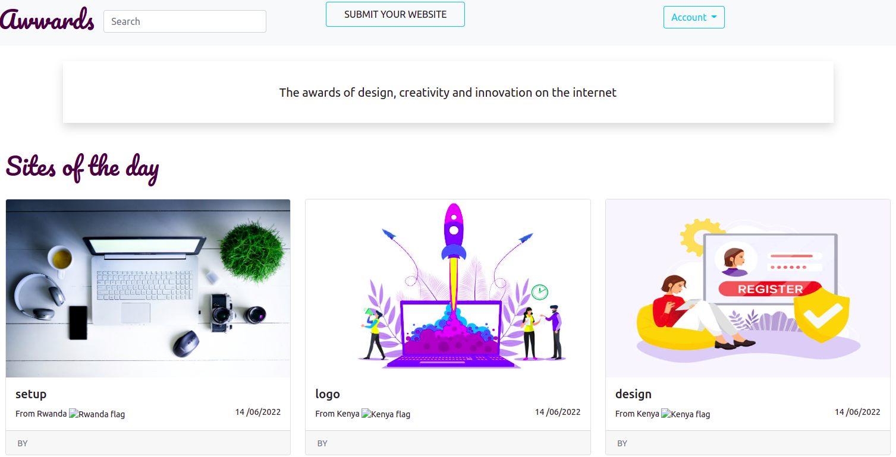

## Awwards
# Author
Linetlucy Genchabe

## Description
This application will allow a user to post a project he/she has created and get it reviewed by his/her peers.


## User Stories

User Can :-

* View posted projects and their details
* Post a project to be rated/reviewed
* Rate/ review other users' projects
* Search for projects 
* View projects overall score
* View my profile page

## Home 


## Behaviour Driven Development
| Behaviour | Input | Output |
| :---------------- | :---------------: | ------------------: |
| Application starts | **On page load** | Login page for user to login |
| Registration| **Registration page** | The registration page has a register form for new users  to register to the application and are redirected to login |
| Image click | **Image click** | Modal appears with the project details and description and  button where the user clicks and is redirected to a reviews page for rating and reviews|
| Submit website button | **Button click** | User can submit a project via a button click|


## Installation Requirements

### Prerequisites

- Django
- Pip & Python
- cloudinary 
- Postgres Database
- Django RestFramework
- 

## Instructions

To use this awwards project .......  
  
##### Clone Repository:  
 ```bash 
https://github.com/linetlucy-genchabe/The-Awwards.git 
```
##### Install and activate Virtual Environment virtual  
 ```bash 
cd <projectname> && python3 -m venv virtual && source virtual/bin/activate 
```  
##### Install Dependencies  
 ```bash 
 pip install -r requirements.txt 
```  
##### Setup Database  
  SetUp Database User,Password, Host then following Command  

 ```bash 
python manage.py makemigrations  
 ``` 


 ```bash 
 python manage.py migrate 
```
##### Run Application  
 ```bash 
 python3 manage.py runserver 

```
##### Test Application  
 ```bash 
 python manage.py test <appname>
```
Open the application on your browser `127.0.0.1:8000`.  


## Technologies Used

* Python
* Html5
* CSS
* Bootstrap
* Django
* Postgress


## License

MIT License


## Author's Info

* linetlucy21@gmail.com  

<p align = "center">
    &copy; 2022 @Linetlucy Genchabe.
</p>